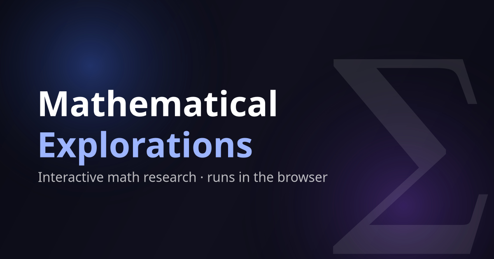

# 

A collection of original interactive mathematical experiments and essays—all running live in your browser with no
installation required. Each lab is a small piece of in-browser mathematical research rather than a textbook
visualization; most began as a question I'd carried for years — sometimes decades — that simply never had the
tooling to be finished and shared.

🔗 **Live site:** [math.cognotik.com](https://math.cognotik.com/)

---

## ✨ What Is This?

This is a working laboratory disguised as a website. Most "math visualization" sites animate things you already
know — a Mandelbrot zoom, a Fourier wheel, a prime sieve. Those live here too, as warm-ups. But the heart of the
collection is a set of **original investigations**: questions that were asked, attacked with code and mathematics,
and written up honestly — including where they lead somewhere new and where they cheerfully admit they lead nowhere
useful.

A note on provenance, in the interest of honesty: none of this is generated insight. AI-assisted tooling supplied
the leverage to close the loops, build the visualizations, and handle the publishing — but the questions, the
intuitions, and the judgment about what was worth chasing are human.

Three ideas recur across nearly everything here, and noticing them turns a grab-bag of demos into a single
conversation:

1. **Geometry as computation.** Numbers, knots, lattices, and tilings are treated as _processes_ — things that run,
   diffuse, optimize, or unfold — rather than static objects.
2. **Optimization as a lens.** Many labs share the same three optimizers (Adam, L-BFGS, and the homegrown **QQN**).
   Watching _how_ a problem is solved often reveals as much as the answer itself.
3. **Honesty about limits.** Several pieces are built around what _cannot_ be decided, computed, or distinguished —
   and treat that boundary as the interesting part, not an embarrassment.

If you read nothing else, read that list again on your way out. It's the through-line.

---

## 🚀 Getting Started

Open `index.html` in any modern web browser, or serve the folder with any static file server:

```bash
npx serve .
# or
python -m http.server
```

Then navigate to the URL shown in your terminal (e.g. `http://localhost:3000` for `serve`, `http://localhost:8000` for
Python).

Everything runs **client-side**. No build step, no server, no account. The heavier labs lean on
[TensorFlow.js](https://www.tensorflow.org/js) (loaded from a CDN) for GPU-accelerated tensors and automatic
differentiation; the rest is plain HTML, CSS, and JavaScript.

---

## 🗺 A Guided Tour

Read this section like a museum walk. You can wander in any order, but the rooms are arranged so each one sets up
the next.

### Room 1 — Warm-Ups: The Classics

Start where everyone starts. The [short demonstrations](#-short-demonstrations) — the **Mandelbrot Set**, the
**Prime Number Sieve**, **Fourier Series**, and the **Collatz Conjecture** — are the familiar faces of recreational
mathematics. They're here to calibrate the eye: simple rules, surprising structure. Each one quietly previews a
theme the deeper labs develop. The Mandelbrot set is iteration that never settles; Fourier series is _building a
shape out of simpler motions_; primes and Collatz are _discrete processes hiding continuous-looking patterns_. Hold
those thoughts.

### Room 2 — When Lattices Stop Behaving

A lattice is the most orderly object in mathematics: a perfect grid, the same in every direction. Three labs ask
what happens when you _break_ that perfection in principled ways.

- **[Irrational Lattice](experiments/irrational_lattice/index.html)** introduces a new primitive: _algebraic colored
  lattice fields_. Instead of adding random noise to a grid (structureless) or leaving it periodic (sterile), it
  deforms each point by a displacement living in a quadratic number field $\mathbb{Q}(\sqrt{D})$, then snaps back to
  the nearest lattice point. The result is **deterministic, provably aperiodic, spectrally tunable** disorder — and
  it's computed with pure integer arithmetic, making it embarrassingly parallel. Visually it conjures the moiré
  ghosts of Penrose tilings, _constrained to a square grid_.

- **[Pentagonal Lattice Geometry](experiments/Pentagon_Lattice_Geometry/index.html)** takes the opposite tack: a
  pentagon _can't_ tile the plane (its angles don't divide 360°), so what if you let it fail upward into a
  **multi-sheeted covering space**? The payoff is genuinely strange: an emergent **fractional dimension** ($d \approx
  2.37$), and **spinor-like holonomy** — loop once around a vertex and you land on a different sheet; you must loop
  _twice_ to come home, exactly like a spin-½ particle needing a 4π rotation. The pentagon turns out to sit at a
  unique algebraic crossroads, tied to the golden ratio's field $\mathbb{Q}(\sqrt{5})$.

- **[Space-Color Symmetry](experiments/symmetry_simple/index.html)** is the gentlest of the three and the most
  hypnotic. You draw on a small pixel canvas while symmetry operations (mirrors, rotations, toroidal wrapping) mirror
  your strokes — standard kaleidoscope fare. The twist: symmetry also **rewires the diffusion graph**, so color
  spreads along the symmetry axes as if the canvas were a quotient manifold. A moment-preserving renormalization keeps
  the colors from washing out to grey, so the pattern swirls forever.

The connecting thread: **the algebraic structure you put in determines the geometry you get out.** Pentagon's
$\mathbb{Q}(\sqrt{5})$ gives fractional dimension; a rational field gives a clean integer lattice; two independent
irrationals refuse to close at all. This is stated most explicitly in the Pentagon lab, but it's the same melody the
Irrational Lattice plays.

### Room 3 — Points That Arrange Themselves

Now we hand the steering wheel to an optimizer and watch points settle into configurations no human placed.

- **[Geometric Entropy](experiments/geometric-entropy/index.html)** is the continuous cousin of the classical Erdős
  distinct-distance problem. Rather than _counting_ distinct pairwise distances, it treats them as a probability
  distribution and **maximizes the Shannon entropy** of that distribution on a manifold — sphere, torus, cube,
  saddle, or any STL mesh you upload. The most "distance-diverse" arrangement emerges. Its most charming (and the
  README's word, "useless") discovery: because the optimum is _degenerate_ — many configurations achieve the same
  $H \approx \ln N$ — the _shape_ you get is a **fingerprint of the optimizer**. Adam leaves noisy lattices, QQN
  leaves smooth symmetric curves, L-BFGS snaps to crystals. You can identify the optimizer from the picture.

- **[Spacelike Knots](experiments/spacelike-knots/index.html)** equips a 3D knot with a **Minkowski metric** — pick
  an axis to call "time" — and reclassifies every pair of points as timelike, spacelike, or lightlike. The over/under
  of a crossing becomes a **causal inversion**. The distance matrix becomes a causal diagram of a tiny relativistic
  spacetime. Physics-based optimization (edge springs + repulsion) keeps the knot from collapsing, and you can rotate
  it to extremize its causal structure.

- **[No-Three-in-Line](experiments/3inline/README.md)** (the _3inline_ lab) tackles a hard combinatorial problem —
  place as many points as possible on an $n \times n$ grid so no three are collinear — by **relaxing it into
  continuous space**. Collinearity is penalized by an angle-based energy that diverges as any triple straightens out.
  Gradient descent crystallizes the points back onto the lattice, and a validation pass checks every triple exactly.
  It works in 3D too.

The thread here: **hard discrete problems become tractable when you let them flow continuously**, and **the path
matters** — the optimizer's personality shows up in the answer.

### Room 4 — Life on Top of Life

- **[Layered Cellular Automata](experiments/layered_ca/index.html)** stacks three classic systems into one feedback
  sandwich. **Langton's ants** crawl across a multi-color grid, their turn rules encoded in binary indexed by the
  color beneath them. The trail they paint becomes a **substrate**, and a selectively-activated **Conway's Game of
  Life** evolves only on cells the ants have "activated" — with positive zones that spawn life and negative zones that
  inhibit it. Highways, fractal boundaries, and competing colonies emerge from the interplay of three layers that
  each only know their own rules.

This room is the collection's reminder that **emergence needs no continuous mathematics at all** — just simple
discrete rules in conversation.

### Room 5 — Learning a Shape

- **[Fractal Learning](experiments/fractal_learning/index.html)** runs the Mandelbrot warm-up in reverse. Given a
  target image, it **fits an iterated function system** (the recipe behind ferns and Sierpiński triangles) by
  gradient descent under a Chamfer distance metric. Instead of asking "what does this fractal look like?", it asks
  "what fractal _is_ this?"

This closes the loop opened in Room 1: iteration forward (Mandelbrot) and iteration learned backward (Fractal
Learning).

### Room 6 — The Essays: Foundations

Where the labs play, the [essays](#-essays) think. They're longer, written investigations into how computation and
number meet.

- **[Quadratic Quasi-Newton (QQN)](essays/QQN/index.html)** is the source of that mysterious third optimizer haunting
  half the labs. It interpolates between **gradient descent** (robust, slow) and **L-BFGS** (fast, fragile) by fitting
  a quadratic along the search direction. Having met its _behavior_ in Geometric Entropy's fingerprints, here you meet
  its _theory_.

- **[Rational Certificate Complexity (RCC)](essays/RCC/index.html)** proposes a taxonomy of mathematical constants
  stratified by how _expensive_ it is to certify their digits. Some numbers are cheap to pin down; others demand
  ever-growing work. It's a complexity theory for the constants themselves.

- **[The Simplest Increment: x + sin(x)](essays/PI_RCC/index.html)** is RCC made concrete and delightful: a
  cubic-convergent iteration for π, built from the derivative structure of a single analytic function. Each step
  roughly _triples_ the number of correct digits.

- **[Numbers as Machines (NAM)](essays/NAM/index.html)** is the philosophical keystone. It reimagines every number as
  a **deterministic, forkable virtual machine** that emits an infinite digit stream on demand. A rational, π, $\sqrt
  2$ — each is a tiny program implementing one primitive: `step → (digit, next state)`.

### Room 7 — Numbers You Can Touch

- **[nam — the interactive numbers-as-machines lab](experiments/nam-calculator/README.md)** is the NAM essay made
  playable: a browser calculator (and matching REPL) over the `nam` library, compiled to WebAssembly. Here the
  collection's third theme — **honesty about limits** — becomes a literal contract printed on the screen:

  - Comparison is **tri-state** (`Less | Greater | Indistinguishable`), because equality of infinite streams is
    undecidable — and the lab refuses to fake a definite answer.
  - Forking a number reports its **cost tier** (O(1) for rationals and $\sqrt 2$, O(log n) for series like π and $e$).
  - Changing base is a **codec**, not a new number — the same machine, re-projected.
  - When a digit can't be _proven_, it renders as honest `pending (null)` rather than a fabricated guess.

This room and the NAM essay are the clearest statement of the whole site's ethic: a tool that **never tells you a
comfortable lie**.

### Room 8 — Physics, Honestly Approximate

- **[Relativistic 2-Body Gravity](experiments/gravity/README.md)** simulates two gravitating bodies with finite
  light speed (**retarded interactions**) and tunable relativistic corrections. Because gravity propagates at speed
  $c$, each body feels where the other _was_, not where it _is_ — breaking Newton's third law for the instantaneous
  pair and producing orbital precession and chaos. It openly declares itself a tool for _intuition_, not a GR solver:
  another instance of the site's honesty about what it is and isn't.

### Room 9 — Language as Camouflage

- **[Predictive Markov Wordsearch](experiments/wordsearch/README.md)** ends the tour with pure wit. Ordinary
  wordsearches hide words in _random_ letters — and random noise makes real words pop out. This generator fills the
  grid with letters predicted by a **Markov model** trained on real text, so the background reads like plausible
  language fragments **in all eight directions at once**. The hidden words blend in not because the grid is bigger,
  but because the _noise itself looks like language_. Difficulty by camouflage. A clean little fusion of the
  Fourier-style "build structure from statistics" idea and the multi-directional thinking of the knot and lattice
  labs.

---

## 🧪 Featured Laboratories

Extended interactive studies, each accompanied by documentation describing the underlying mathematics, motivation, and
methods.

| Laboratory                                                                      | Description                                                                                                              |
| ------------------------------------------------------------------------------- | ------------------------------------------------------------------------------------------------------------------------ |
| [Pentagonal Lattice Geometry](experiments/Pentagon_Lattice_Geometry/index.html) | Multi-sheeted covering construction where the pentagon develops fractional dimension (d ≈ 2.37) and spinor-like holonomy |
| [Space-Color Symmetry](experiments/symmetry_simple/index.html)                  | A pixel canvas where symmetry rewires the diffusion graph, producing kaleidoscope dynamics on a quotient-like manifold   |
| [Geometric Entropy](experiments/geometric-entropy/index.html)                   | A continuous analogue of the Erdős distinct-distance problem via Shannon entropy optimization                            |
| [Spacelike Knots](experiments/spacelike-knots/index.html)                       | A knot equipped with a Minkowski metric, turning crossings into causal inversions                                        |
| [Layered Cellular Automata](experiments/layered_ca/index.html)                  | Langton's ants write a colored substrate gating where Conway's Life can live — three feedback layers                     |
| [Fractal Learning](experiments/fractal_learning/index.html)                     | Inverse iterated-function-system fitting via gradient optimization under a Chamfer metric                                |
| [Irrational Lattice](experiments/irrational_lattice/index.html)                 | Deterministic, algebraic "colored noise" for lattices — provably aperiodic, spectrally tunable                           |
| [No-Three-in-Line](experiments/3inline/index.html)                              | Continuous relaxation of a classic combinatorial problem via angle-based collinearity penalties (2D & 3D)                |
| [Relativistic 2-Body Gravity](experiments/gravity/index.html)                   | Retarded, relativistically-corrected two-body orbits exhibiting precession and chaos                                     |
| [Predictive Markov Wordsearch](experiments/wordsearch/index.html)               | A PWA that hides words in Markov-generated filler that reads like language in all eight directions                       |

## 📝 Essays

Extended written investigations into the foundations of computational mathematics.

| Essay                                                          | Description                                                                                        |
| -------------------------------------------------------------- | -------------------------------------------------------------------------------------------------- |
| [Quadratic Quasi-Newton](essays/QQN/index.html)                | A new optimization algorithm interpolating between gradient descent and L-BFGS                     |
| [Rational Certificate Complexity](essays/RCC/index.html)       | A computational taxonomy of mathematical constants, stratified by certificate cost                 |
| [The Simplest Increment: x + sin(x)](essays/PI_RCC/index.html) | A cubic-convergent iteration for π built from the derivative structure of an analytic function     |
| [Numbers as Machines](essays/NAM/index.html)                   | A generator-based numerics library where every number is a deterministic, forkable virtual machine |

## 🧮 Short Demonstrations

Compact, self-contained demonstrations of classical mathematical concepts.

| Demonstration                                        | Description                                   |
| ---------------------------------------------------- | --------------------------------------------- |
| [Mandelbrot Set](experiments/basic/mandelbrot.html)  | Zoom and pan the iconic complex-plane fractal |
| [Prime Number Sieve](experiments/basic/primes.html)  | Animated Sieve of Eratosthenes                |
| [Fourier Series](experiments/basic/fourier.html)     | Build waveforms from rotating circles         |
| [Collatz Conjecture](experiments/basic/collatz.html) | Visualize the 3n+1 sequence                   |

---

## 🧵 How It All Connects

A few threads tie the collection together. Pull any one and the rest follow:

- **The shared optimizers.** Adam, L-BFGS, and **QQN** appear across Geometric Entropy, Spacelike Knots,
  No-Three-in-Line, and Fractal Learning. The QQN essay explains the algorithm; the labs let you _watch its
  personality_ — most vividly in Geometric Entropy's "optimizer fingerprinting," where the optimum is so degenerate
  that the optimizer's path becomes visible in the final shape.

- **Algebraic number fields → geometry.** $\mathbb{Q}(\sqrt{D})$ is the quiet engine behind the **Irrational
  Lattice** (colored aperiodic noise) and **Pentagonal Lattice Geometry** (fractional dimension from
  $\mathbb{Q}(\sqrt{5})$). The same field structure underlies the **NAM** machinery, where $\sqrt 2$ is an O(1)
  "automaton-tier" number precisely because its algebra is simple.

- **Continuous relaxation of discrete problems.** **No-Three-in-Line** (combinatorics → gradient descent),
  **Geometric Entropy** (Erdős distance counting → entropy maximization), and **Fractal Learning** (discrete IFS →
  differentiable fit) all share the move: replace a hard search over a discrete set with a smooth landscape you can
  flow downhill on.

- **Honesty about the undecidable.** **NAM** and its **calculator** make tri-state comparison and `pending (null)`
  first-class citizens. **RCC** quantifies the _cost_ of certainty. **Relativistic Gravity** is upfront that it's
  qualitative, not exact. The collection consistently treats the limits of computation as features to expose, not
  flaws to hide.

- **Iteration, forward and backward.** **Mandelbrot** and **Fractal Learning** are the same idea facing opposite
  directions; **x + sin(x)** and **NAM** are iteration in the service of _numbers themselves_; the **Layered CA**
  is iteration as raw emergence.

Whether you arrived to zoom a fractal or to argue about decidability, there's a door for you — and they all open into
the same building.

## 📚 Prior Art, References & Novelty Appraisal

This section situates each piece against existing work and gives an honest assessment of what is genuinely new versus
what is a fresh recombination of known ideas. Where something is _not_ novel, it says so; where novelty is plausible
but unverified, it is flagged as such rather than asserted.

### Methodological lineage (the recurring moves)

- **Continuous relaxation of discrete problems** is old and deep: LP/SDP relaxations (Lovász ϑ, Goemans–Williamson
  MAX-CUT, 1995), the Hopfield–Tank neural TSP relaxation (1985), and "soft" differentiable combinatorics
  (e.g. Gumbel-softmax, Jang et al. 2016; differentiable sorting, Cuturi et al. 2019). The labs here apply this
  well-established lens to _recreational/geometric_ problems rather than inventing the lens itself.
- **Optimizer comparison / "fingerprinting"** intersects the loss-landscape visualization literature (Li et al.,
  _Visualizing the Loss Landscape of Neural Nets_, 2018) and basin-of-attraction studies. The specific framing —
  _reading the optimizer's identity off a degenerate optimum's geometry_ — is an unusual and, as far as I can tell,
  underexplored presentation, even if the underlying phenomenon (path-dependence under degeneracy) is well known.

### Room-by-room appraisal

- **Mandelbrot / Primes / Fourier / Collatz.** Purely pedagogical reimplementations of classics
  (Mandelbrot 1980; Sieve of Eratosthenes; Fourier 1822; Collatz 1937). No novelty claimed, and none should be.
- **Irrational Lattice.** Closely related to _aperiodic order_ and _cut-and-project / model sets_ (Meyer 1972;
  de Bruijn 1981 on Penrose tilings; Baake & Grimm, _Aperiodic Order_, 2013) and to lattice-displacement noise.
  The specific recipe — per-point displacement in $\mathbb{Q}(\sqrt{D})$ followed by snap-to-lattice, computed in
  exact integer arithmetic for embarrassingly-parallel, provably-aperiodic "colored" disorder — appears to be a
  genuinely original _construction_, even if every ingredient (quadratic fields, quasicrystals, blue/colored noise)
  is individually classical. **Plausibly novel construction; utility: procedural texturing / sampling — niche.**
- **Pentagonal Lattice Geometry.** The pentagon's non-tiling and its $\mathbb{Q}(\sqrt 5)$ / golden-ratio ties are
  textbook (Penrose 1974; Conway–Coxeter). Branched/covering-space resolutions of geometric frustration echo
  translation-surface and orbifold ideas (Thurston; Veech surfaces). The claimed _emergent fractional dimension
  $d\approx2.37$_ and _spinor-like $4\pi$ holonomy_ are striking but should be read as **numerically observed
  properties of this specific construction**, not established theorems — worth independent verification.
- **Space-Color Symmetry.** Kaleidoscopic symmetry drawing is ubiquitous; the distinctive move is letting symmetry
  **rewire the diffusion graph** (a quotient-manifold Laplacian) with moment-preserving renormalization. Related to
  reaction–diffusion on symmetric/quotient domains (Turing 1952; graph-Laplacian diffusion). **Novel framing of a
  familiar toy; utility: aesthetic.**
- **Geometric Entropy.** Directly engages the Erdős distinct-distances problem (Erdős 1946; resolved up to logs by
  Guth–Katz 2015). Recasting it as **Shannon-entropy maximization of the pairwise-distance distribution on arbitrary
  manifolds/meshes** is a continuous, differentiable reformulation that I have not seen stated this way.
  **Plausibly novel reformulation; primary value is conceptual/illustrative** (the README's own "useless" caveat is
  apt — the optimum's degeneracy undercuts any single "best" configuration).
- **Spacelike Knots.** Knot energies (Möbius energy, O'Hara 1991; Freedman–He–Wang 1994) and causal-set/Lorentzian
  geometry (Bombelli–Lee–Meyer–Sorkin 1987) are both mature, but **imposing a Minkowski metric on a knot so that
  crossings become causal inversions** is an unusual cross-pollination. **Likely novel as a juxtaposition; utility:
  intuition-building, not a research tool.**
- **No-Three-in-Line.** The combinatorial problem is classic (Dudeney 1917; Hall–Jackson–Sudbery–Wild 1975).
  The **angle-based collinearity penalty that diverges as triples straighten, plus exact validation**, is a
  reasonable continuous heuristic. It will not match exhaustive/SAT methods on guarantees, and is honest about that.
  **Sound engineering, modest novelty.**
- **Layered Cellular Automata.** Langton's ant (1986) and Conway's Life (1970) are foundational; **coupling them so
  the ant's trail gates where Life may evolve** is a fun composite in the spirit of multi-layer/coupled CA. **Novelty
  is in the coupling; utility: emergence demonstration.**
- **Fractal Learning.** Inverse-IFS / fractal inverse problems have a real literature (Barnsley's _collage theorem_,
  1985; Vrscay; later neural approaches). Fitting an IFS by **gradient descent under a Chamfer distance** is a modern,
  reasonable instantiation. **Technique is established in spirit; this is a clean differentiable implementation.**
- **QQN (Quadratic Quasi-Newton).** Sits among quasi-Newton/trust-region/line-search hybrids (Nocedal–Wright,
  _Numerical Optimization_). Interpolating GD↔L-BFGS via a **quadratic fit along the search direction** resembles
  model-based line searches and damped/regularized Newton steps. **Convergence/benchmark claims should be checked
  against standard baselines before treating it as a contribution rather than a well-motivated heuristic.**
- **RCC / NAM / x+sin(x).** These engage real foundations: computable/constructive reals (Turing 1936; Bishop;
  exact real arithmetic — Boehm's "constructive reals," and `iRRAM`/MPFR-style libraries), and irrationality/
  complexity measures of constants. **NAM's generator-based "number as forkable VM" with tri-state comparison** is a
  pedagogically excellent packaging of _undecidable equality of computable reals_ — a known fact made tangible.
  The **x+sin(x) cubic iteration for π** is a clean, likely-known fixed-point/Householder-flavored scheme; the value
  is exposition. **RCC's "certificate-cost taxonomy" is the most speculative essay — interesting framing, needs
  formalization to claim more.**
- **Relativistic 2-Body Gravity.** Retarded-potential / finite-c gravity toys exist widely; it explicitly disclaims
  being a GR solver. **No novelty claimed; honest intuition tool.**
- **Predictive Markov Wordsearch.** Markov-chain text generation is textbook (Shannon 1948). The clever twist is
  using it so **filler reads like language in all eight directions**, making concealment a property of the _noise's
  statistics_ rather than grid size. **Novelty is the application/insight; utility: genuinely better puzzles.**

### Bottom line

The collection's strongest original contributions are **constructions and framings** — the algebraic colored lattice,
the entropy reformulation of Erdős distances, the Minkowski-metric knot, optimizer fingerprinting, and the
tangible-undecidability NAM tooling — rather than new theorems. Several quantitative claims (Pentagon's $d\approx2.37$
and $4\pi$ holonomy; QQN's performance) are **empirical observations worth independent verification**. This appraisal
is offered in the same spirit the site advertises: prefer an honest "plausibly novel, unverified" over a comfortable
overclaim.

---

---

## 🗂 Project Structure

```
index.html              ← Landing page / experiment gallery
css/
  style.css             ← Shared stylesheet
  home.css              ← Landing page styles
js/
  home.js               ← Landing page logic (README previews, modals)
  marked.min.js         ← Markdown renderer
  optimizer-*.js        ← Shared QQN / Adam / L-BFGS optimizers
experiments/
  basic/                ← Short classical demonstrations
  3inline/              ← No-Three-in-Line continuous solver
  Pentagon_Lattice_Geometry/  ← Multi-sheeted polygon covers
  symmetry_simple/      ← Space-Color Symmetry
  geometric-entropy/    ← Continuous Erdős distinct-distance
  spacelike-knots/      ← Minkowski-metric knots
  layered_ca/           ← Langton's ants × Conway's Life
  fractal_learning/     ← Inverse IFS fitting
  irrational_lattice/   ← Algebraic colored-noise lattices
  gravity/              ← Relativistic 2-body gravity simulator
  nam-calculator/       ← Numbers-as-machines interactive lab
  wordsearch/           ← Predictive Markov wordsearch PWA
essays/
  QQN/                  ← Quadratic Quasi-Newton
  RCC/                  ← Rational Certificate Complexity
  PI_RCC/               ← The Simplest Increment: x + sin(x)
  NAM/                  ← Numbers as Machines
terraform/              ← Infrastructure for static hosting (S3 + CloudFront)
scripts/                ← Sitemap and OG-image generation
```

## 🛠 Implementation

Implemented in plain HTML, CSS, and JavaScript — no build step, and no dependencies beyond a couple of CDN-loaded
libraries (MathJax, Mermaid, TensorFlow.js, and a handful of d3 modules for the geometric labs). The heavier labs use
TensorFlow.js for GPU-accelerated automatic differentiation; the `nam` calculator runs a WebAssembly build of a C++
library. Deployed as a static site to AWS S3 + CloudFront via Terraform.

## 📄 License

See [LICENSE](LICENSE).
