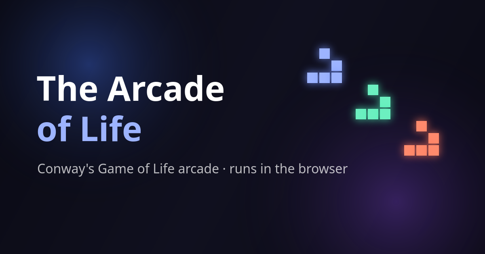
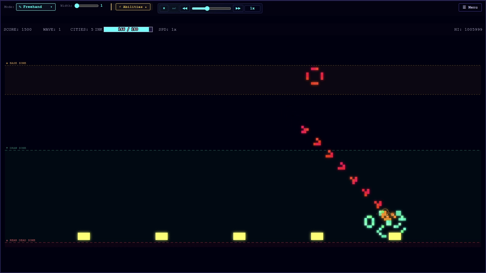
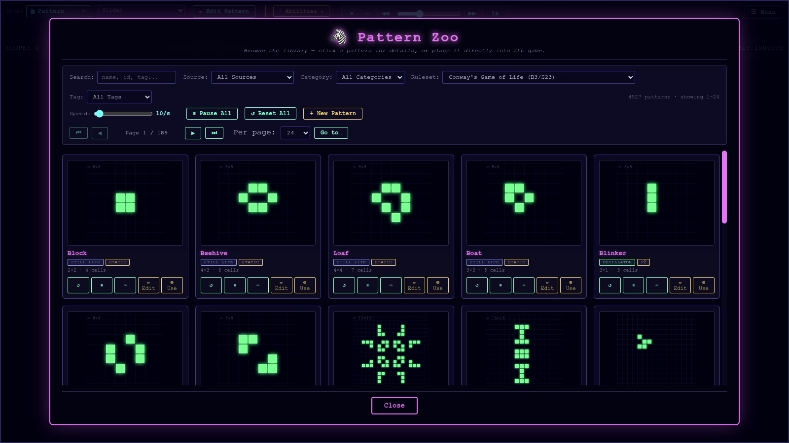
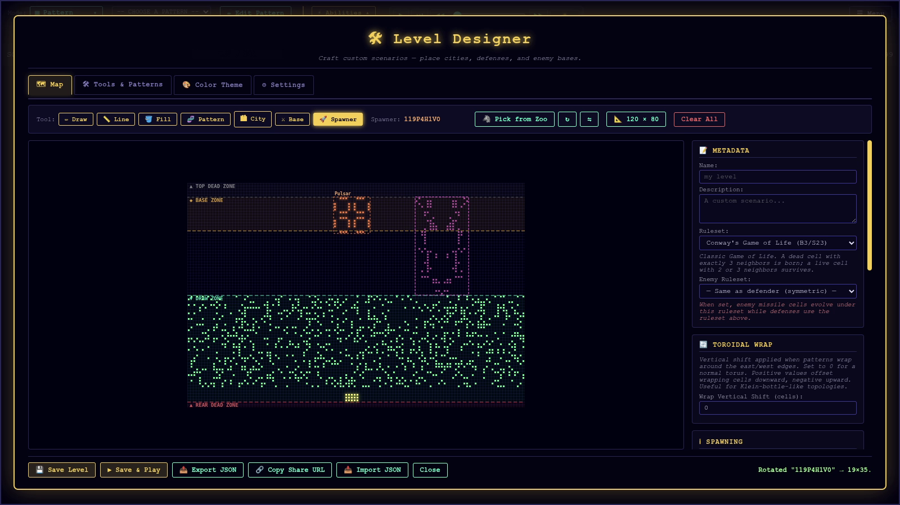

# 

> **A browser-based arcade where Conway's Game of Life stops being a screensaver and starts fighting back.**

A small arcade of games built entirely on
cellular automata — Conway's Game of Life and many other rulesets. The premise is simple to
state and surprisingly deep to play: you draw living patterns, they evolve according to a handful of
neighbor-counting rules, and those evolving structures become your defenses against waves of incoming
"missiles" that are themselves nothing more than gliders.

---

## What It Is

At its heart, the Arcade of Life is a collection of games that share one unusual engine. Instead of scripted
enemies and hand-authored physics, everything on screen — your defenses, the enemy missiles, the chaos in
between — obeys the same simple, deterministic rules of a cellular automaton. You don't so much _command_
your defenses as _plant_ them, then watch what grows.

There are a few ways to play:

- **Missile Defender** — Enemy gliders descend on your cities; you draw cells of life to intercept them. A
  simple horizontal line, it turns out, evolves into a spreading wave that can knock down several missiles
  at once.
- **Space Invaders** — The classic, reimagined. Your cursor is pre-loaded with a glider; fire it upward,
  and glider and invader annihilate on contact.
- **Tower Defense** — A slower, puzzle-flavored mode where placement matters more than reflexes. You lay
  down barriers and fire tiles, commit, and then watch your plan hold or crumble.
- **Fire Line** — Not really a game at all, but a spectacle: two banks of glider guns firing across a line
  of fire tiles, evolving into a battlefield you can simply sit back and watch.



---

## A Little Background

For the unfamiliar: **Conway's Game of Life** is not a game in the usual sense — it has no players and no
goals. It's a grid of cells, each alive or dead, that updates in lockstep according to three rules:

- A dead cell with exactly **three** living neighbors comes to life.
- A living cell with **two or three** neighbors survives.
- Everything else dies, of loneliness or overcrowding.

From those three rules emerges an astonishing menagerie: stable blocks that sit still forever, oscillators
that blink in place, and — most famously — **gliders**, small arrangements of cells that march diagonally
across the grid indefinitely. Mathematician John Conway devised this in 1970; it has fascinated people ever
since precisely because so much complexity falls out of so little.

What this project does is take that "screensaver" and give it stakes. The gliders that hobbyists have
admired for fifty years become the missiles you're trying to shoot down. The patterns you'd normally place
just to see what happens become your artillery.

```
. ■ .        . . ■        . . .        . . .
. . ■   →    ■ . ■   →    . ■ ■   →    ■ . ■   → (and on it travels, shifted)
■ ■ ■        . ■ ■        ■ ■ .        . . ■
                   The glider — your missile.
```

---

## Why It's Interesting

A few reasons this turned out to be more rewarding to build — and, I hope, to play — than I first expected:

1. **Emergence you can steer.** In ordinary games you fight the designer's intentions. Here you're
   negotiating with a mathematical system that doesn't know you exist. A defense that looks solid can
   collapse into noise a few generations later; a careless scribble can bloom into exactly the wave you
   needed. Learning to _aim_ an emergent process is a genuinely different skill.

2. **Fifty-plus rulesets, one interface.** Conway's B3/S23 is only the default. Switch to **HighLife** and
   patterns start self-replicating; switch to **Seeds** and everything detonates into explosive growth;
   switch to **Life Without Death** and your defenses become permanent fortifications. Each ruleset is,
   in effect, a different physics — and the same drawing you make behaves like a different weapon under
   each one.

3. **It's a playground as much as a game.** Beyond the arcade modes there's a **Pattern Zoo** — a
   searchable library of hundreds of documented Life patterns, from humble blinkers to Gosper's famous
   glider gun — and a **Level Designer** for building and sharing your own scenarios. You can just as
   easily use the whole thing as a sandbox for watching cellular automata do their thing.



4. **No install, no accounts, no friction.** It runs in a browser, works offline once loaded, and asks
   nothing of you. Open it and play.

---

## The Interface, Briefly

You interact with the world mostly by drawing. A small toolbox lets you lay down cells freehand, in lines,
as rectangles and ellipses, as flood-fills, or by stamping a ready-made pattern from the library. Different
"inks" behave differently:

- **Defense** and **Enemy** ink are living cells that evolve under the active rules.
- **Barrier** ink is inert — a static wall that never changes and blocks the spread of life.
- **Fire** ink is a permanently-alive cell that acts as a persistent hazard.

You pause, step generation-by-generation to study what's unfolding, speed the simulation up or slow it to
a cinematic crawl, zoom, pan, and (on a phone) pinch and drag. The controls are conventional enough that
you'll rarely need to think about them; the interesting decisions all happen in _what you draw_ and _which
rules you draw it under_.



---

## Who Might Find This Useful

I built this for the joy of it, but a few audiences may get more than idle fun out of it:

- **The simply curious** — anyone who has ever watched a Game of Life animation and wondered what it would
  feel like to _use_ those patterns will find an approachable way in.
- **Students and educators** — it's a hands-on introduction to emergence, determinism, and cellular
  automata that rewards experimentation over lecture. Comparing the same pattern across Conway, HighLife,
  and Seeds teaches more about rulesets than any table could.
- **Life enthusiasts** — the Pattern Zoo draws on the community-documented LifeWiki dataset, so the
  spaceships, oscillators, guns, and methuselahs you already know are all here to deploy.
- **Tinkerers** — the level designer and exotic rulesets (hexagonal and triangular grids, history-aware
  and probabilistic engines) offer a lot of room to explore well past the arcade premise.

---

## A Candid Note

This began as a personal investigation into whether cellular automata could carry a real game loop, and
grew into something more substantial along the way. Some rulesets make for elegant, readable play; others
devolve into beautiful mush that's more fun to watch than to win. That variance is, I think, part of the
charm — you're never entirely in control, and that's rather the point. Your mileage may vary, and I'd
genuinely like to hear where it takes you.

---

## Getting Started

Open the game in any modern browser — visit **[https://aol.cognotik.com](https://aol.cognotik.com)** — and
start drawing. On desktop you can install it as an app; on mobile, add it to your home screen. It works
fully offline once loaded.

Enjoy — and remember, every defense pattern you draw is, in a small way, alive. Treat it well. 🌱
